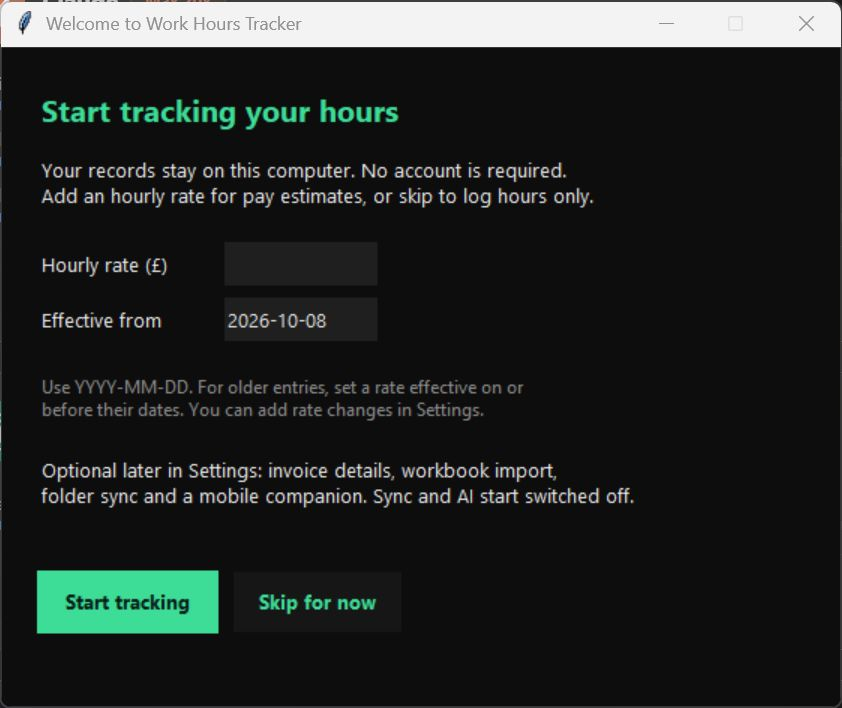

<p align="center">
  
</p>

<h1 align="center">Work Hours Tracker</h1>

<p align="center">A simple desktop home for your hours, timesheets and invoices.</p>

<p align="center">
  <a href="../../releases/latest">Download for Windows</a> ·
  <a href="#run-from-source">Run from source</a> ·
  <a href="PRIVACY.md">Privacy</a> ·
  <a href="CONTRIBUTING.md">Contribute</a>
</p>

Work Hours Tracker is a Windows desktop app with a dark interface, local Excel storage and PDF invoices. Start with a blank tracker, choose your own rates, and keep control of your data. No account or subscription is required for ordinary tracking.

<p align="center">
  
</p>

Amounts currently use GBP (£), and the summary workbook uses UK tax-year groupings. Other currencies and tax-year systems are not configurable in this release. Check totals before using them for invoices or financial reporting.

| View | What you can do |
| --- | --- |
| **Log Today** | Record dates, start/end times, breaks and work summaries. |
| **Timesheet** | Review and edit entries in monthly sheets. |
| **Invoice** | Generate PDF invoices using your own details and rates. |
| **Dashboard** | See hours and earnings across months. |
| **Settings** | Manage rates, invoice details, optional exports and reminders. |

## Download and start

**Windows 10/11, 64-bit. Python is included in the downloadable app.**

1. Open [the latest release](../../releases/latest) and download `Work-Hours-Tracker-1.0.0-windows-x64.zip` from **Assets**.
2. Right-click the ZIP → **Extract All**. Put the extracted folder somewhere you intend to keep it, such as `Documents\Work Hours Tracker App`.
3. Open **Work Hours Tracker.exe**. Use the welcome screen to set an optional hourly rate, or skip it to track hours first.
4. To add it to your desktop, right-click the extracted executable → **Show more options** → **Send to** → **Desktop (create shortcut)**.

Extract the ZIP before launching. The app does not require administrator access. Download the named ZIP asset for the ready-to-run app; GitHub's **Source code** archives require Python setup.

Releases are unsigned, so Windows may show an unknown-publisher notice. Verify the download source and checksum before deciding whether to run it. Keep Windows security protections enabled.

### Check your download

Download the matching `.zip.sha256` asset and compare it with:

```powershell
Get-FileHash .\Work-Hours-Tracker-1.0.0-windows-x64.zip -Algorithm SHA256
```

The hash should match the value in the checksum file. This checks that the ZIP matches the published asset; it is not a code-signing certificate.

## Your first entries

Set hourly rates and their effective dates in **Settings**. Leaving rates unset lets you start with hours-only tracking; add rates when you need earnings or invoices. Fill in invoice and payment details only if you want them printed on your PDFs.

Use **Log Today** to save an entry, then open **Timesheet** to review it. Changes rebuild the workbook and create a backup before overwriting an existing workbook. Close the workbook in Excel before saving changes in the app.

### Bring an existing tracker

Use the import control in **Settings** to select a compatible Work Hours Tracker workbook. Review the confirmation before replacing the local tracker. The source file is left unchanged, and an existing local workbook is backed up. Generic Excel spreadsheets with different columns may need conversion; the importer does not infer an arbitrary spreadsheet's meaning.

## Where your data goes

On Windows, your private files live in `%LOCALAPPDATA%\WorkHoursTracker`, separately from the download/source folder.

| File or folder | Contents |
| --- | --- |
| `Work_Hours_Tracker.xlsx` | The authoritative local timesheet. |
| `config.json` | Your rates, invoice details and chosen settings. |
| `backups\` | Workbook backups; the newest 30 are retained. |
| `invoices\` | Generated PDF invoices. |

These files are ordinary, unencrypted files protected by your computer's access controls. Back up the data folder somewhere private before transferring computers. Installing a new app version does not require copying anyone else's data or configuration.

Folder mirroring, invoice mirroring, mobile exports, reminders and AI are optional. Cloud exports start disabled. If you choose a folder synced by OneDrive or another provider, that provider can receive the exported files. Read [PRIVACY.md](PRIVACY.md) before enabling exports.

For development or a separate test installation, set `WORK_HOURS_TRACKER_DATA_DIR` to an absolute folder **before** starting the app. The app uses that folder for its private data.

### Optional mobile companion

Enable the mobile HTML export in **Settings** and choose a private export folder. The generated HTML contains a snapshot of your hours, rates and work summaries. Including invoice/client/payment details requires a separate opt-in. It has no AI integration and does not connect to a remote service.

Open the exported file in a browser that supports local HTML files. Browser/phone file access varies, especially inside cloud-storage apps. Phone entry JSON files can be placed in the chosen export folder's `inbox` and imported through the desktop app after review. No Android APK is included in this release.

### Optional work-note summaries

The desktop's AI action can turn selected work notes into bullet points using Anthropic's API. It requires your own API key and may incur provider charges. You must confirm the notes-to-provider transfer before a request is sent. Other tracking features work without it.

The key is stored through a supported secure operating-system keyring, or can be supplied using `ANTHROPIC_API_KEY`. It is never included in the workbook or mobile export. If secure key storage is unavailable, the app reports that instead of saving a key in a plaintext settings file.

The default model is `claude-haiku-4-5-20251001`. Provider availability can change. To select another compatible Anthropic Messages model, set `WORK_HOURS_TRACKER_AI_MODEL` to its model ID before launching the app. Check the provider's current model documentation and pricing; this setting does not enable AI or send a request by itself. [Anthropic's model lifecycle page](https://platform.claude.com/docs/en/about-claude/model-deprecations) lists current availability.

## Run from source

Install **64-bit Python 3.11–3.14** with Tcl/Tk from [python.org](https://www.python.org/downloads/windows/). Download and extract the repository's source ZIP, then open PowerShell in that folder.

```powershell
powershell -NoProfile -File .\setup.ps1 -CreateDesktopShortcut
powershell -NoProfile -File .\run.ps1
```

Setup uses a project-local `.venv`, installs pinned direct dependencies and creates a desktop shortcut only when requested. It refuses to overwrite an existing source shortcut. No administrator access is needed. Keep the source folder in place while using its shortcut.

If your machine's policy prevents scripts from running, review the scripts and follow the manual commands below, or use the executable release. Managed machines may have policies controlled by your organisation.

```powershell
py -3 -m venv .venv
.\.venv\Scripts\python.exe -m pip install -r requirements.txt
.\.venv\Scripts\python.exe app.py
```

Select a specific interpreter when necessary:

```powershell
powershell -NoProfile -File .\setup.ps1 -PythonExecutable 'C:\Python314\python.exe'
```

Linux/macOS source use is experimental and requires Tk support and the same Python versions. Windows reminders are unavailable there. Manual source setup uses `python3 -m venv .venv`, `.venv/bin/python -m pip install -r requirements.txt`, then `.venv/bin/python app.py`.

## Build and test

```powershell
# Developer environment and tests
powershell -NoProfile -File .\setup.ps1 -InstallDev
.\.venv\Scripts\python.exe -m pytest tests -q

# Separate build environment, tests, fresh executable and release ZIP
powershell -NoProfile -File .\build.ps1
```

The Windows build uses `.build-venv` and packages only the freshly built executable, version, quick start and licence/privacy documents. ZIPs and SHA256 files appear in `release\`. It never copies an executable over your desktop app. Build on Windows with a 64-bit interpreter for the Windows x64 release.

CI runs tests for pushes and pull requests. Version tags trigger the Windows release workflow. See [CONTRIBUTING.md](CONTRIBUTING.md) for development and release checks.

## Troubleshooting

| Problem | Try this |
| --- | --- |
| Workbook locked / save fails | Close the workbook in Excel and retry. Check the data folder is writable. |
| App exits immediately | Check whether another instance is already open. For source use, run `run.ps1` to see errors. |
| Python or Tk is missing | Install a supported 64-bit Python build with Tcl/Tk, then rerun setup. |
| Source shortcut stops working | Keep the source folder in place or recreate its shortcut after moving it. |
| Mirror/export has not updated | Check the chosen folder is writable and your sync provider is running. The local workbook remains authoritative. |
| AI is unavailable | Ordinary tracking still works. Check secure key storage and provider access; never paste keys in an issue. |

## Project and licence

Application code is in `app.py`, `core/` and `ui/`. Tests are in `tests/`; release packaging is in `scripts/`. Dependencies have their own licences; see [THIRD_PARTY_NOTICES.md](THIRD_PARTY_NOTICES.md).

Released under the [MIT licence](LICENSE). Suggestions and fixes are welcome. Before reporting an issue, remove work notes, names, addresses, bank details, API keys and private file paths from screenshots or error reports.
